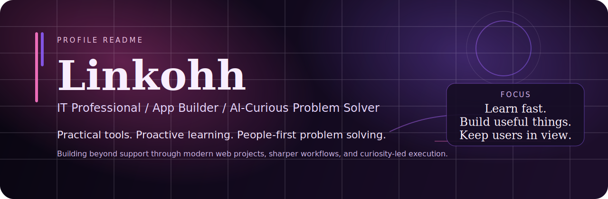

  

  
  &nbsp;&nbsp;&nbsp;&nbsp;
  
  &nbsp;&nbsp;&nbsp;&nbsp;
  

  

<h3 align="center">I.T. Professional | Practical Developer | UX-Focused | AI Enthusiast</h3>

## About Me

I am an IT professional who likes turning real user problems into practical digital tools. I am proactive by default, always learning, and I stay close to new technology so I can keep growing beyond day-to-day support work. My foundation comes from hands-on troubleshooting and user care, but I keep extending that foundation by building with Python, JavaScript, Next.js, and AI-assisted workflows.

I use AI to strengthen what I already know, not replace the fundamentals. The goal is to keep learning fast, build useful things, and create experiences that feel clear, dependable, and genuinely helpful.

## Tools I Use

  
  
  
  
  
  

  
  
  
  
  

  <strong>Editors &amp; Workflow</strong>

  
  
  
  

  <strong>Primary AI workflow</strong>

  
  
  

  <strong>Also comfortable with</strong>

  
  
  
  
  

## Featured Work

### [Fitness Workout Planner](https://github.com/Linkohh/fit-wizardly)

Built to help users create personalized workout plans from a large exercise library without losing clarity around target muscles, reps, sets, rest time, or intensity.

`JavaScript` `HTML` `CSS`

### [Word Count App](https://github.com/Linkohh/Counter-Characher-words-and-others-)

A fast writing utility that gives instant word and character feedback so users can check limits, refine copy, and track text length in real time.

`JavaScript` `HTML` `CSS`

### More in Progress

I am actively expanding this portfolio with experiments like `Vibeme` and other app ideas focused on cleaner workflows, practical interfaces, and AI-supported product thinking.

`TypeScript` `Next.js` `AI Workflows`

## How I Work

The way I work is shaped by curiosity, ownership, and a strong bias toward useful outcomes. I like to move with intention, keep people in view, and keep learning as I build.

⚡ **Proactive**  
I like moving early, reducing ambiguity, and solving problems before they turn into friction.

🔍 **Curious**  
I stay close to new tools, patterns, and ideas so I can keep expanding how I think and work.

🤝 **People-first**  
My support background keeps me focused on the user experience, not just the implementation details.

🧭 **Adaptable**  
I can shift between troubleshooting, learning, building, and refining based on what the situation actually needs.

🧠 **Fast learner**  
I pick up new frameworks, workflows, and technologies by doing the work and staying consistent with it.

🎯 **Solution-oriented**  
I care most about outcomes that are clear, dependable, and genuinely useful to the people on the other side.

## GitHub Proof

This is a real-time look at my development activity, tech stack, and primary repositories. I believe in letting the work speak for itself.

### 📊 Activity & Stack

  
  &nbsp;&nbsp;&nbsp;&nbsp;
  

### 📌 Pinned Repositories

  
  &nbsp;&nbsp;&nbsp;&nbsp;
  

## Connect

If you want to connect around practical apps, AI-assisted workflows, or useful tools that solve real problems, feel free to reach out.

  
  &nbsp;&nbsp;&nbsp;&nbsp;
  
  &nbsp;&nbsp;&nbsp;&nbsp;
  

